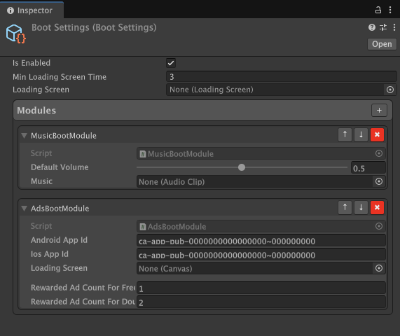

# Bootstrapping

Bootstrapping provides clean, centralized **entry points** for initializing your game's global systems and scene-specific logic.

---

## Why Bootstrapping?

Unity doesn’t offer a clean, built-in way to manage complex initialization flows across game and scene scope. You end up writing singleton managers, bloated `Awake` chains, or fragile script execution orders.

Bootstrapping introduces a structured alternative:

- A **Game Boot** phase that runs once at startup — ideal for setting up services, SDKs, and game-wide state.
- A **Scene Boot** phase that runs after each scene is loaded — perfect for initializing scene-specific logic in a predictable and asynchronous-friendly way.

This gives you full control over your project’s launch process, with a minimal and flexible API.

It solves a real problem in Unity development: lack of deterministic and modular system initialization. By providing centralized entry points, Bootstrapping lets you eliminate fragile dependencies and gain clear visibility into how and when systems start.

Bootstrapping is:
- Editor-integrated
- MonoBehaviour-free
- Architecture-agnostic — compatible with Zenject, addressables, async/await, or custom patterns.

---

## Features

- Initialize global systems at game start with Game Boot Modules
- Configure boot modules via custom editor inspector
- Control execution order of modules visually
- Guaranteed execution before any game logic
- Scene Boot for scene-specific initialization
- Support for both sync and async boot logic
- Optional loading screen with minimum display time

---

## Installing

To install via UPM, use "Install package from git URL" and add the following:

```
1. https://github.com/CliffCalist/grouped-performance.git
2. https://github.com/CliffCalist/editor-flex-list.git
3. https://github.com/CliffCalist/Bootstrapping.git
```

---

## Usage

### Game Boot Modules

Game Boot Modules provide a guaranteed initialization point that runs **before any `Awake` or `Start` method** in the scene at index 0 — making them ideal for preparing critical systems once at the very beginning of your game session.

This is especially useful for:
- Initializing third-party SDKs (e.g. ads, analytics)
- Requesting platform permissions
- Setting up game-wide services or loading persistent data

Example of a synchronous module:
```csharp
public class MySyncBootModule : BootModule
{
    protected override void Run()
    {
        Debug.Log("Synchronous init");
    }
}
```

Asynchronous modules are executed on the **main thread** without blocking it, allowing you to safely use Unity API inside `RunAsync()`. Example of an asynchronous module:
```csharp
public class MyAsyncBootModule : AsyncBootModule
{
    protected override async Task RunAsync()
    {
        await Task.Delay(500);
        Debug.Log("Asynchronous init");
    }
}
```

---

### Registering Modules

To register boot modules, open the `Assets/Resources/BootSettings` asset. Its custom inspector provides a **Modules** section where you manage the list of registered modules.

Here's how to use the interface:
- Click **"+"** to add a new unregistered module.
- Use **"↑"** and **"↓"** to change the module’s order.
- Click **"✖"** to remove a module from the list.
- Expand any module to configure its serialized fields.

> To ensure module fields show up in the inspector, follow Unity's standard serialization practices.

You can freely reorder modules, and they will be executed in the exact order shown.



---

### Scene Boot

SceneBoot is the scene-specific bootstrap module. Each scene can define its own `SceneBoot` class, which serves as a controlled entry point for initializing systems, loading data, or handling scene-level setup.

 A common example is loading game progress. For instance, if your game pulls data from a remote database, you can use `Run()` to load this data and then initialize your systems in the correct order — such as applying settings, showing UI, and setting up audio.

When all setup is complete, you must call `OnFinished()` to notify Bootstrapping that the scene is ready. This is especially important for controlling the loading screen lifecycle (explained in the next section).

Example:

```csharp
public class GameplaySceneBoot : SceneBoot
{
    public override void Run()
    {
        LoadGameProgress(() =>
        {
            LoadUserSettings();
            SetupUI();
            InitializeAudio();
            // Other boot logic

            OnFinished();
        });
    }

    // Methods LoadGameProgress, LoadUserSettings, SetupUI...
}
```

Notes:
- `SceneBoot` is optional — scenes without a SceneBoot won't trigger errors.
- Only one `SceneBoot` is expected per scene. If multiple are present, one of them will still be executed, but which one is not guaranteed.

---

### Preload Scene (required)

Bootstrapping requires a scene named `Preload` to act as an intermediate scene between unloading the current scene and loading the next one. Its purpose is to reduce memory spikes by ensuring the previous scene is fully unloaded before the next one begins loading.

This scene is **mandatory** and must be configured correctly in the Build Settings.

Bootstrapping includes built-in editor automation to assist with this. If the `Preload` scene is missing or misconfigured, it will automatically display a dialog allowing you to fix the issue in one click. The fix will create the scene and place it at the correct build index if needed.

You can also trigger this process manually via the Unity menu:  
`Tools → WhiteArrow → Bootstrapping → Fix Preload Scene Issue`
 
---

### Loading Screen

Loading screens are automatically displayed during scene transitions. Specifically, the loading screen becomes visible at the beginning of scene loading and stays on screen until the corresponding `SceneBoot` calls `OnFinished()` to signal that the scene is fully initialized.

If the loaded scene does not have a `SceneBoot` component, the loading screen will hide automatically once Unity finishes loading the scene.

To create your own loading screen, simply inherit from the `LoadingScreen` class:
```csharp
public class MyLoadingScreen : LoadingScreen
{
    public override bool IsShowed => gameObject.activeSelf;

    public override void Show(bool skipAnimations, Action callback)
    {
        // Display your UI
        gameObject.SetActive(true);
        callback?.Invoke();
    }

    public override void Hide()
    {
        // Hide your UI
        gameObject.SetActive(false);
    }
}
```

Assign your loading screen prefab in `Assets/Resources/BootSettings`. This is enough for the system to automatically instantiate and manage the screen.

You can also configure `_minLoadingScreenTime` in the same asset to ensure the screen is visible long enough for a smooth UX (especially when loading is very fast).

---

### SceneLoader

The `SceneLoader` is the core entry point for transitioning between scenes. It ensures proper execution of the `SceneBoot` logic and manages the display of the loading screen.

You can load scenes by index or name using the simplified API:

```csharp
SceneLoader.LoadScene(1);
SceneLoader.LoadScene("Level01");
```

---

### Editor Integration

This package includes several helpful editor tools:

- **`Tools → WhiteArrow → Bootstrapping → Enable / Disable`** — allows to toggle the bootstrapping system on or off in the current project.
- **`Tools → WhiteArrow → Bootstrapping → Fix Preload Scene Issue`** — validates and fixes the required Preload Scene (creates it if missing and ensures it's at build index 0).

---

## Profiling Support

Bootstrapping uses [StackedProfiling](https://github.com/CliffCalist/stacked-profiling.git) for custom profiling of module execution.

- Each Game Boot Module is wrapped in a profiler sample with its type name
- Scene Boot classes are also profiled
- A global "GameBoot" sample wraps the entire game boot process

This enables better insight into boot performance and helps identify slow modules independently of Unity’s built-in timeline profiler.

---

## Roadmap

- [x] Auto-create and configure the Preload scene if missing
- [x] Use Preload as Build Index 0 to avoid initial scene reloading
- [x] Refactor `SceneLoader.LoadScene` into a non-coroutine async method
- [ ] Support parallel execution of Game Boot Modules with controlled dependencies
- [ ] Framework settings window:
  - [x] Assign loading screen prefab via editor instead of code
  - [x] Define module execution order visually
  - [ ] Toggle Preload scene usage
- [ ] Remove dependency
  - [x] Remove dependency on UnityTools
  - [ ] Remove dependency on GroupedPerformance
