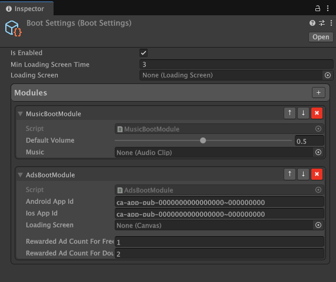

# Bootstrapping

Bootstrapping provides clean, centralized **entry points** for initializing your game's global systems and scene-specific logic.

---

## Why Bootstrapping?

Unity doesn’t offer a clean, built-in way to manage complex initialization flows across game and scene scope. You end up writing singleton managers, bloated `Awake` chains, or fragile script execution orders.

Bootstrapping introduces a structured alternative:

- A **Game Boot** phase that runs once at startup — ideal for setting up services, SDKs, and game-wide state.
- A **two-phase Scene Boot** flow that runs after each scene is loaded:
  - **Prepare phase** (`PrepareSceneAsync`) for pre-initialization setup (optional)
  - **Initialize phase** (`InitializeSceneAsync`) for starting scene logic at the correct moment

This gives you full control over your project’s launch process, with a minimal and flexible API.

It solves a real problem in Unity development: lack of deterministic and modular system initialization. By providing centralized entry points, Bootstrapping lets you eliminate fragile dependencies and gain clear visibility into how and when systems start.

Bootstrapping is:
- Editor-integrated
- MonoBehaviour-free
- Architecture-agnostic — compatible with Zenject, addressables, async/await, or custom patterns.

---

## Features

- Initialize global systems at game start with Game Boot Modules
- Configure boot modules via custom editor inspector
- Control execution order of modules visually
- Guaranteed execution before any game logic
- Two-phase Scene Boot for scene-specific setup and initialization
- Support for both sync and async boot logic
- Optional loading screen with minimum display time
- Delayed scene logic start until loading screen timing constraints are satisfied

---

## Installing

To install via UPM, use "Install package from git URL" and add the following:

```
1. https://github.com/CliffCalist/editor-flex-list.git
2. https://github.com/CliffCalist/Bootstrapping.git
```

---

## Usage

### Game Boot Modules

Game Boot Modules provide a guaranteed initialization point that runs **before any `Awake` or `Start` method** in the scene at index 0 — making them ideal for preparing critical systems once at the very beginning of your game session.

This is especially useful for:
- Initializing third-party SDKs (e.g. ads, analytics)
- Requesting platform permissions
- Setting up game-wide services or loading persistent data

Example of a synchronous module:
```csharp
public class MySyncBootModule : BootModule
{
    protected override void Run()
    {
        Debug.Log("Synchronous init");
    }
}
```

Asynchronous modules are executed on the **main thread** without blocking it, allowing you to safely use Unity API inside `RunAsync()`. Example of an asynchronous module:
```csharp
public class MyAsyncBootModule : AsyncBootModule
{
    protected override async Task RunAsync()
    {
        await Task.Delay(500);
        Debug.Log("Asynchronous init");
    }
}
```

---

### Registering Modules

To register boot modules, open the `Assets/Resources/BootSettings` asset. Its custom inspector provides a **Modules** section where you manage the list of registered modules.

Here's how to use the interface:
- Click **"+"** to add a new unregistered module.
- Use **"↑"** and **"↓"** to change the module’s order.
- Click **"✖"** to remove a module from the list.
- Expand any module to configure its serialized fields.

> To ensure module fields show up in the inspector, follow Unity's standard serialization practices.

You can freely reorder modules, and they will be executed in the exact order shown.



---

### Scene Boot

`SceneBoot` is the scene-specific bootstrap module. Each scene can define its own `SceneBoot` class, which serves as a controlled entry point for scene setup and startup.

`SceneBoot` now has **two phases**:

- `PrepareSceneAsync()` — **optional** phase for preparing data and scene state before logic starts.
- `InitializeSceneAsync()` — required phase where scene logic actually starts.

The default implementation of `PrepareSceneAsync()` is already completed, so you only override it when needed.

Why split into two phases?
- You can prepare the scene while the loading screen is still visible.
- You can delay actual scene logic startup until minimum loading screen time is reached.
- This prevents gameplay from running behind a visible loading screen, which improves UX.

Simple one-phase problem example:
- If preparation and initialization are merged into one method, the scene can start reacting to input before the minimum loading screen time ends.
- Result: the game is already running, but the player still sees the loading screen for a short time.
- For reaction-sensitive games, this is unacceptable and degrades UX.

Example:

```csharp
public class GameplaySceneBoot : SceneBoot
{
    protected internal override async Task PrepareSceneAsync()
    {
        // Optional: preload/save restore/setup data.
        await LoadGameProgressAsync();
        await WarmupAddressablesAsync();
    }

    protected internal override async Task InitializeSceneAsync()
    {
        // Start scene logic only when SceneLoader calls initialize phase.
        LoadUserSettings();
        SetupUI();
        InitializeAudio();
        await SpawnGameplayAsync();
    }
}
```

Notes:
- `SceneBoot` is optional — scenes without a SceneBoot won't trigger errors.
- Only one `SceneBoot` is expected per scene. If multiple are present, one of them will still be executed, but which one is not guaranteed.
- Both `PrepareSceneAsync()` and `InitializeSceneAsync()` are executed on the main thread and can safely use Unity API before/after `await`.

---

### Preload Scene (required)

Bootstrapping requires a scene named `Preload` to act as an intermediate scene between unloading the current scene and loading the next one. Its purpose is to reduce memory spikes by ensuring the previous scene is fully unloaded before the next one begins loading.

This scene is **mandatory** and must be configured correctly in the Build Settings.

Bootstrapping includes built-in editor automation to assist with this. If the `Preload` scene is missing or misconfigured, it will automatically display a dialog allowing you to fix the issue in one click. The fix will create the scene and place it at the correct build index if needed.

You can also trigger this process manually via the Unity menu:  
`Tools → WhiteArrow → Bootstrapping → Fix Preload Scene Issue`
 
---

### Loading Screen

Loading screens are automatically displayed during scene transitions. The loading screen becomes visible at the beginning of scene loading and stays visible through:
- scene loading,
- optional `PrepareSceneAsync()` phase,
- remaining minimum display time,
- `InitializeSceneAsync()` phase.

If the loaded scene does not have a `SceneBoot` component, the loading screen will hide automatically once Unity finishes loading the scene.

To create your own loading screen, simply inherit from the `LoadingScreen` class:
```csharp
public class MyLoadingScreen : LoadingScreen
{
    public override bool IsShowed => gameObject.activeSelf;

    public override void Show(bool skipAnimations, Action callback)
    {
        // Display your UI
        gameObject.SetActive(true);
        callback?.Invoke();
    }

    public override void Hide()
    {
        // Hide your UI
        gameObject.SetActive(false);
    }
}
```

Assign your loading screen prefab in `Assets/Resources/BootSettings`. This is enough for the system to automatically instantiate and manage the screen.

You can also configure `_minLoadingScreenTime` in the same asset to ensure the screen is visible long enough for a smooth UX (especially when loading is very fast). Scene logic starts in `InitializeSceneAsync()`, so the scene does not begin running while the loading screen is still forced to stay visible.

---

### SceneLoader

The `SceneLoader` is the core entry point for transitioning between scenes. It ensures correct `SceneBoot` phase order and manages loading screen timing.

Current order:
1. Show loading screen
2. Load `Preload` intermediate scene (if needed)
3. Load target scene
4. Run `PrepareSceneAsync()` (if SceneBoot exists)
5. Wait for remaining minimum loading-screen time
6. Run `InitializeSceneAsync()`
7. Hide loading screen

You can load scenes by index or name using the simplified API:

```csharp
SceneLoader.LoadScene(1);
SceneLoader.LoadScene("Level01");
```

---

### Editor Integration

This package includes several helpful editor tools:

- **`Tools → WhiteArrow → Bootstrapping → Enabled`** — allows to toggle the bootstrapping system on or off in the current project.
- **`Tools → WhiteArrow → Bootstrapping → Fix Preload Scene Issue`** — validates and fixes the required Preload Scene (creates it if missing and ensures it's at build index 0).

---

## Logging

Bootstrapping runtime logging is controlled by `LogLevel` in `Assets/Resources/BootSettings`.

Available levels:
- `ErrorsOnly` — logs only critical failures (`Debug.LogError` / `Debug.LogException`) such as game boot module execution errors.
- `Summary` — includes `ErrorsOnly` plus high-level flow logs:
  - game bootstrap start and finish,
  - target scene loading start and success,
  - warning when `SceneBoot` is missing in a loaded scene,
  - disabled bootstrapping notice.
- `Verbose` — includes `Summary` plus detailed flow logs:
  - per-module start/finish logs for game boot modules,
  - intermediate `Preload` scene loading logs,
  - profiling timing reports.

Use `Summary` for regular development visibility and `Verbose` for deep diagnostics.

---

## Profiling Support

Bootstrapping includes built-in profiling utilities and no longer depends on external profiling packages.

- Profiling logs are shown only when `LogLevel` is set to `Verbose`.
- After all `BootModule` executions, the console prints a summarized report with each module's execution time and aggregate stats (total / avg / min / max).
- After scene bootstrap completes, the console prints scene bootstrap timing with phase breakdown for `SceneBoot` (`PrepareSceneAsync` and `InitializeSceneAsync`).

This gives immediate visibility into boot performance without additional setup.

---

## Roadmap

- [x] Auto-create and configure the Preload scene if missing
- [x] Use Preload as Build Index 0 to avoid initial scene reloading
- [x] Refactor `SceneLoader.LoadScene` into a non-coroutine async method
- [ ] Support parallel execution of Game Boot Modules with controlled dependencies
- [ ] Framework settings window:
  - [x] Assign loading screen prefab via editor instead of code
  - [x] Define module execution order visually
  - [ ] Toggle Preload scene usage
- [ ] Remove dependency
  - [x] Remove dependency on UnityTools
  - [x] Remove dependency on GroupedPerformance
